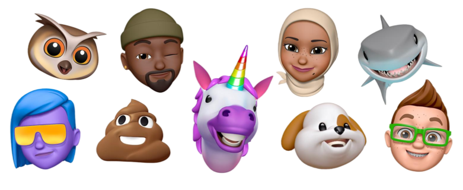

<h1 align="center">
  <picture>
    <source media="(prefers-color-scheme: dark)" />
    
  </picture>
 <br />
</h1>
<p align="center">
Zootopians are the First Open-Source Digital Humans 🐰🦊🐻
</p>
<p align="center">
  <a href="https://discord.gg/w7p3U9wn"></a>
  <a href="https://github.com/AIDropout/ZOOTOPIA"></a>
  <a href="https://github.com/AIDropout/ZOOTOPIA/blob/main/LICENSE"></a>
</p>

Help us build characters that are highly convincing, customizable, and dynamic — from boyfriend to personal secretary.

Make your own `Twilio SMS` Zootopian powered by `Gemini LLM` with `Bing Search` & `Stripe Payment` in minutes, not weeks ⚡

## 🌆 Features

### Behaviors
- [x] Intent detection
- [x] Auto DB
- [ ] Not responding to every single message
- [ ] Human-like memory
- [ ] Preference tracking
- [ ] Proactive messages
- [ ] Scheduling
- [ ] Vision

### Channels
- [x] Bird SMS
- [x] Telegram
- [ ] WhatsApp
- [ ] Twilio
- [ ] Phone calls

### Web Access
- [x] Google Calendar
- [x] Google Drive
- [ ] Search

### LLMs
- [x] Gemini
- [x] Groq
- [x] OpenAI
- [x] Anthropic

## 🛣️ Roadmap

- [ ] Make a master config file
- [ ] Working boyfriend agent demo
- [ ] High-level overview, documentation


## 🛠️ Environment Setup
Make sure Python, [ngrok](https://ngrok.com/), and [uv]() are installed.

   ```bash
   # 1 Navigate to the repository. Install [uv](https://github.com/astral-sh/uv):
   pip install uv 

   # 2. Create a virtual environment at .venv
   uv venv  

   # 3. Activate environment. 
   source .venv/bin/activate # macOS and Linux
   .venv\Scripts\activate # Windows

   # 4. Install dependencies  
   uv pip install -r requirements.txt

   ```

Copy `local.template.yaml` to a new file called `local.yaml` in the same directory

## 🚀 Usage
Run the project:
```bash
python run.py
```

Interact with the demo:
- Add +1 (833) 819-1677 to contacts, or
- Add @AIHealthCoachBot on Telegram

## Dependencies
Add new dependencies:
```bash
uv pip install [package_name]
uv pip freeze > requirements.txt
```

## Contributors

[](https://github.com/AIDropout/ZOOTOPIA/graphs/contributors)

## License

[MIT License](LICENSE.md).

